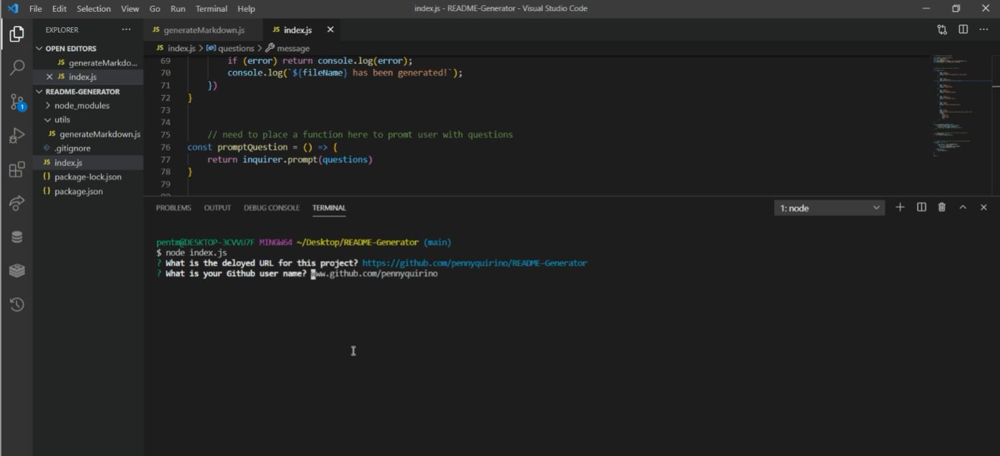

# README.md Generator

## Table of Contents
 - [Description](#description)
 - [Installation](#installation)
 - [Credits](#credits)

## Description
To create a high-quality README.md file using command-line application with node.js

## Installation
install all required npm packages, create index.js file and generateMarkdown.js file, create and test code

## Credits
No collaborators for this project

## License
This project and its source code is released under the [MIT](https://opensource.org/licenses/MIT) license.

## Demo Video
<a href="https://drive.google.com/file/d/1BeAFuK4JIqUEmF3flX2sWy69SccIkgto/view">Click here to view video of application in action</a>

## Check out more of my work via my GitHub Profile at: https://github.com/pennyquirino
